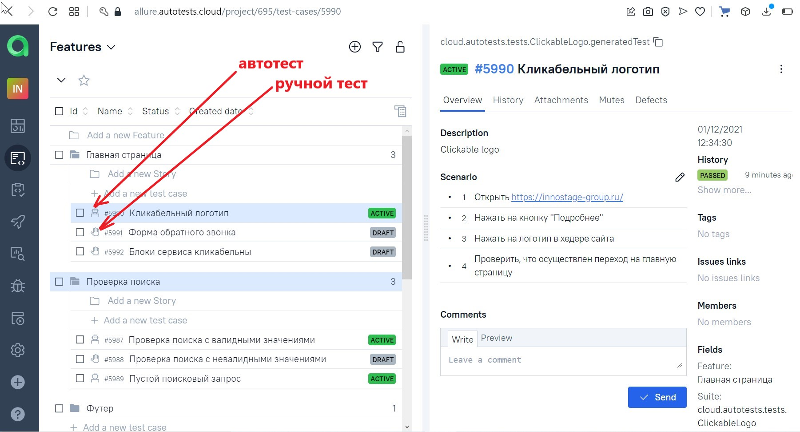

# Проект по автоматизации тестирования для компании [Innostage](https://innostage-group.ru/)

## Тестовая модель:

- [x] Title главной страницы
- [x] Поле поиска
- [x] Наличие ошибок в консоле

## Используемые технологии и инструменты

<a href="https://www.jetbrains.com/idea/">
    
</a>
<a href="https://www.java.com/">
    
</a>
<a href="https://ru.selenide.org/">
    
</a>
<a href="https://aerokube.com/">
    
</a>
<a href="https://gradle.org/">
    
</a>
<a href="https://junit.org/junit5/docs/current/user-guide/">
    
</a>
<a href="https://allure.qatools.ru/">
    
</a>
<a href="https://qameta.io/">
    
</a>
<a href="https://github.com/QASvetlana">
    
</a>
<a href="https://www.jenkins.io/">
    
</a>
<a href="https://web.telegram.org/k/">
    
</a>

IntelliJ IDEA, Java, Selenide, Selenoid, Gradle, JUnit5, Allure SE, Allure TestOps, Github, Jenkins, Telegram (reports)
# Конфигурация для запуска тестов
Параметры для запуска автотестов в удаленном браузере на билд-сервере проекта
autotests.cloud задаются в настройках job CI Jenkins в виде Choice Parameter
и передаются в код проекта через терминал как системные переменные (в фигурных скобках) с помощью следующих команд:

```bash
clean
test
-Dbrowser=${BROWSER} // запускаемый браузер
-DbrowserVersion=${BROWSER_VERSION} // версия браузера
-DbrowserSize=${BROWSER_SIZE} // размер окна браузера
-DremoteDriverUrl=https://<username>:<password>@${REMOTE_DRIVER_URL}/wd/hub/ // URL сервера, на котором запускаются тесты
-DvideoStorage=https://${REMOTE_DRIVER_URL}/video/ // URL сервера с видеофайлами выполнения тестов
-Dthreads=${THREADS} // число потоков для прогона тестов


allure serve build/allure-results Генерация отчета
```
### Для запуска автотестов на удаленной машине использован bild server Jenkins

### Тестовая документация хранится в Allure TestOpts

### Отчетность генерируется с помощью Allure reports

### Интеграция с Jira 
Доступен список тест-кейсов, а так же приложен результат запуска автотестов


### Уведомления о результатах тестирования уходят в Telegram

### Видеотчет теста "Поиск товара"

